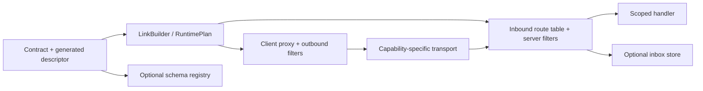

# Architecture

This is the living architecture inventory for the current source tree. It intentionally lists only
projects and boundaries that exist in the solution.

## Runtime flow

`RuntimePlan` is the immutable composition boundary. Contract shape, selected protocols, ordering,
partitioning, native hosting, generated metadata, and serializer requirements are validated before
the bus starts. Microsoft DI adds startup gates for protected routes, inbox store registrations, and
native host exposure before `AnyProtocolHostedService` starts subscriptions.

## Package boundaries

The solution contains 29 source projects.

- `AnyProtocol.Abstraction` owns application contracts, authorization/validation contracts, message
  metadata, schema contracts, and fault types. The former single-purpose
  `Authorization.Abstraction` and `Validation.Abstraction` assemblies were merged here.
- `AnyProtocol` owns runtime composition, routing, dispatch, filters, in-memory inbox/schema
  providers, lifecycle, and generated-registry integration.
- `Protocol.Abstraction`, `Serializer.Abstraction`, `Encoder.Abstraction`, `Storage.Abstraction`,
  `DependencyInjection.Abstraction`, and `Logging.Abstraction` remain independent provider SPIs;
  `Storage.Abstraction` owns the provider-neutral inbox store contract.
- REST, gRPC, Kafka, RabbitMQ, ZeroMQ, InMemory, and MCP remain independently deployable adapters.
- Generator and code-fix projects remain `netstandard2.0` compiler extensions.

Core, abstraction, serializer, encoder, and InMemory packages target `net8.0` and `net10.0`.
Adapters that depend on .NET 10 hosting or third-party runtime surfaces continue to target
`net10.0` until their compatibility matrix is verified.

## Cross-cutting guarantees

- Protected server methods cannot start without both `AuthorizationFilter` and an
  `IAuthorizationProvider`.
- `InboxDeduplicationFilter` acquires a provider-neutral lease, completes it only after handler
  success, and releases it after failure. In-memory and Redis providers implement the same contract.
- `ISchemaRegistry` versions schemas and delegates format-specific compatibility decisions. The
  built-in JSON Schema checker applies conservative backward, forward, and full object-shape rules.
- Shared transport conformance tests cover send/subscribe, fan-out, competing consumers,
  cancellation, readiness, headers, bodies, and declared semantics for InMemory, Kafka, and
  RabbitMQ. Native REST/gRPC and role-oriented ZeroMQ retain operation-specific suites.
- Packable projects run .NET package validation. Historical API baseline comparison is intentionally
  disabled while breaking changes are allowed.

## Verification profiles

`dotnet test AnyProtocol.slnx` starts Kafka, RabbitMQ, and Redis Testcontainers when no external
connection is supplied. Set `ANYPROTOCOL_REQUIRE_BROKER_TESTS=true` to turn unavailable container
infrastructure into a failure instead of a skip. `dotnet pack` runs package validation for packable
projects.
