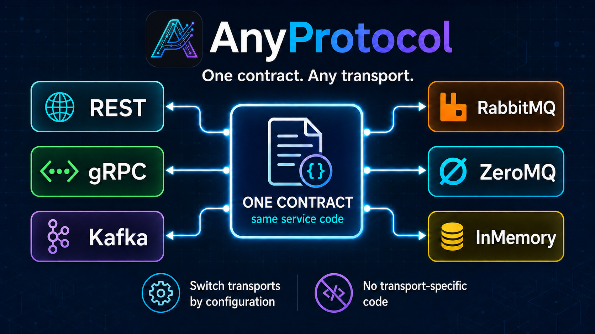

# AnyProtocol

AnyProtocol is a .NET 10 contract-first messaging library. Define one interface, register it as a client or server, and carry the same contract over local (InMemory), HTTP (REST), gRPC, Kafka, RabbitMQ, ZeroMQ, or MCP server transports according to each transport's declared capabilities.

## Start here

- [Getting started](GETTING_STARTED.md)
- [Configuration](CONFIGURATION.md)
- [Envelope codecs](ENCODERS.md)

### Protocols

Choose the transport that matches the deployment boundary and delivery guarantees:

- [InMemory](IN_MEMORY.md) — process-local execution and deterministic tests
- [REST / HTTP](REST.md) — HTTP request/reply endpoints
- [gRPC](GRPC.md) — native unary and server-streaming RPC
- [MCP](MCP.md) — expose selected methods as MCP tools
- [Kafka](KAFKA.md) — durable partitioned event streams
- [RabbitMQ](RABBITMQ.md) — durable topic routing and consumer groups
- [ZeroMQ](ZEROMQ.md) — brokerless socket-based messaging

- [Transport semantics](TRANSPORT_SEMANTICS.md)
- [Performance](PERFORMANCE.md)
- [Deployment](DEPLOYMENT.md)
- [Observability](OBSERVABILITY.md)
- [Security](SECURITY.md)
- [API reference](xref:AnyProtocol)

AnyProtocol validates selected protocols against contract operations during startup. Review transport semantics before production use: request/reply and streaming may be native or emulated, and delivery, durability, ordering, cancellation, and backpressure guarantees differ by transport.
